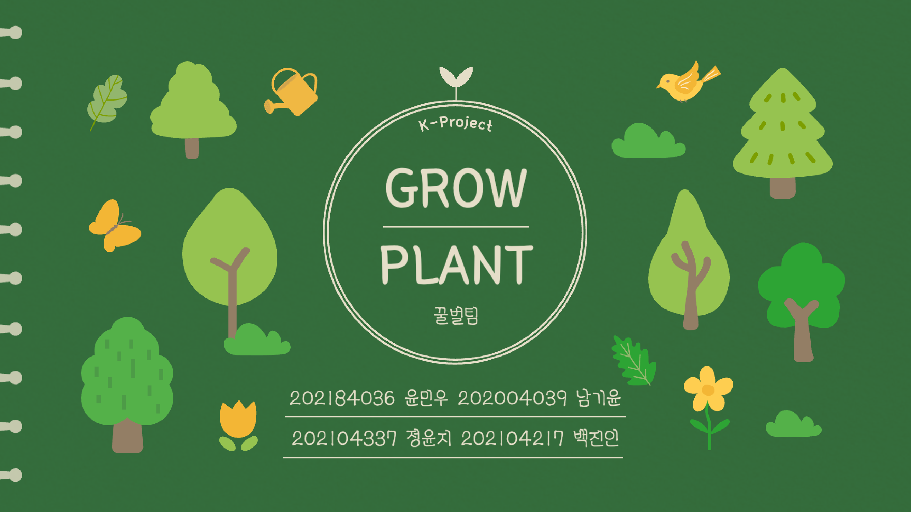

# Grow Plant:식물 키우기(구글플레이스토어 출시)

# 📄 목차
[1. 구글 플레이스토어 링크](#구글-플레이스토어-링크)

[2. 개요](#개요)

[3. 게임 설명](#게임-설명)

[4. 테스트 피드백](#테스트-피드백)

 

## 구글 플레이스토어 링크

 

## 개요

### 📌 프로젝트 이름

Grow Plant

플레이 영상

### 💡 장르

3D 시뮬레이션 힐링

### ⏰ 개발 기간

24.01.26 ~ 23.05.13

### ⚙️ **언어 및 게임 엔진**

### 🛠️ **협업 툴**

### 👩‍💻  **팀 구성원 및 역할**

| 이름 | 윤민우 | 남기윤 | 정윤지 | 백진인 |
| :---: | :---: | :---: | :---: | :---: |
| 역할1 | 3D 모델링 | 날짜 | 이벤트에 따른 UI | UI 디자인 |
| 역할2 | 맵 디자인 | 식물상태 | 사운드 | 사운드 디자인 |
| GitHub | [@minuchan](https://github.com/minuchan) | [@namgy1](https://github.com/namgy1) | [@Yj621](https://github.com/Yj621) | [@Bjinin](https://github.com/Bjinin) |

## 게임 설명
| ||  |
| :---: | :---: | :---: | 
|일차별 선택지|다음 날 식물 상태|죽었을 시| 

 🌱‘GrowPlant’는 매일 변화하는 선택지를 통해 식물을 키우며, 생명의 소중함을 느낄 수 있는 힐링 게임입니다.
개복치 같은 식물을 성장시키며 책임감과 성취감을 경험해보세요!

- 📜 하루하루 달라지는 이벤트와 선택지
    
    게임 속 식물은 매일 새로운 이벤트와 함께 성장합니다. 이벤트에 따른 선택지를 통해 식물의 상태가 호전되거나 악화될 수 있습니다. 선택을 잘못하면 개복치처럼 식물에게 치명적일 수 있으니, 신중히 선택해야 합니다.
    

- 😊 대리 만족과 생명의 소중함
    
    현실에서는 아파트, 빌라 등에서 식물을 기르는 데 제약이 많습니다. GrowPlant는 이를 극복하고 **대리 만족**과 **힐링**을 제공합니다. 성공적으로 개화한 순간의 기쁨, 시드는 과정에서 느껴지는 안타까움을 통해,
    생명의 소중함을 직접 경험할 수 있습니다.
    
    책임감과 조건의 중요성을 배우며, 열매 맺기까지의 여정을 함께하세요
    
- ☔ 날씨에 따라 달라지는 배경
    
    매일 **변화하는 날씨**와 그에 따른 **배경 연출**이 몰입감을 더해줍니다.
    
    - 햇빛이 쏟아지는 맑은 날,
    - 촉촉한 비가 내리는 날,
    - 쌀쌀한 바람이 부는 날까지
    
    날씨에 따른 다양한 분위기로 매일 새로운 환경에서 식물을 키워보세요!
    

GrowPlant를 플레이하며 함께 책임감 있게 식물을 키우고
작은 생명의 소중함을 느껴보세요. 🌱✨

## 게임 플레이 방식

- 상호작용 키(모바일)

|  | 모든 상호작용 | 확대/축소 |
| :---: | :---: | :---: |
| 상호작용 | 클릭 | 줌 인/줌아웃 |

- 게임 내 UI
<table>
  <tr>
    <th>일차별로 달라지는 선택지</th>
  </tr>
  <tr>
    <td>
      
      
    </td>
  </tr>
</table>

<table>
  <tr>
    <th>선택지에 따라 식물 상태를 보여줌</th>
  </tr>
  <tr>
    <td>
      
      
    </td>
  </tr>
</table>

<table>
  <tr>
    <th>죽었을 때 죽은 이유와 함께 창이 뜬다</th>
  </tr>
  <tr>
    <td>
      
      
    </td>
  </tr>
</table>

<table>
  <tr>
    <th>날씨에 따라 달라지는 배경</th>
  </tr>
  <tr>
    <td>
      
      
    </td>
  </tr>
</table>

## 느낀점

출시를 목표로 정해진 기간 내에 간단한 게임을 제작하는 과정은 매우 도전적이었습니다. 간단한 게임이라도 제로에서 시작하여 개발하는 데는 상당한 시간이 소요되었으며, 제작과 배포를 거치면서 많은 성장을 경험할 수 있었습니다.

특히 버그를 수정하는 과정에서 예상치 못한 문제들이 계속해서 발생하며 힘들기도 했지만, 이 모든 과정을 통해 배운 점이 많았습니다. 내가 만든 게임이 실제로 다른 사람들에게 설치되어 플레이되는 모습을 보면서 게임 개발의 매력에 더 깊이 빠져들게 되었습니다.

출시하는 과정에서 aab 파일을 업로드하고 수정하고 콘솔에 등록하며 테스터들을 모집하는데 3개월 이상이 걸렸습니다. 이 기간 동안 테스터들을 모집하고, 그들의 피드백을 반영하며 소통하는 과정에서 출시에 관한 깊은 이해를 얻게 되었습니다. 이 경험을 통해 게임 개발에서의 중요한 요소들인 출시 절차, 테스터와의 소통, 피드백 반영의 중요성을 배우게 되었습니다.

 
 

## 테스트 피드백

 
 

