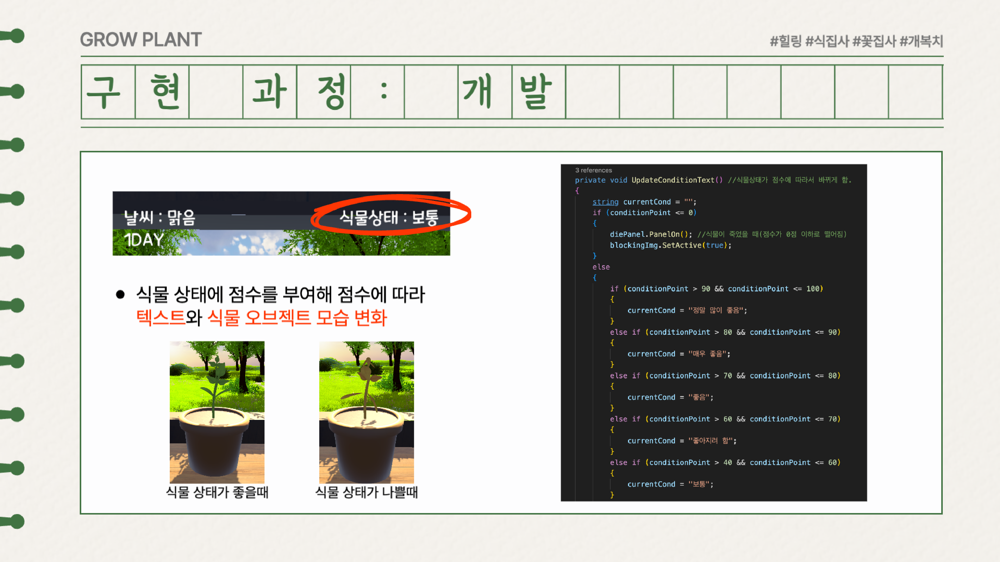

# Grow Plant:식물 키우기(구글플레이스토어 출시)

> ## 목차
> 
>[ 1. 링크](#구글-플레이스토어-링크)
> 
> [2. 게임 소개](#게임-소개)
> 
> [3. 개발 기간](#개발-기간)
> 
> [4. 팀 구성원 및 역할](#팀-구성원-및-역할)
> 
> [5. 개발 환경](#개발-환경)
> 
> [6. 느낀점](#느낀점)
> 
> [7. 테스트 피드백](#테스트-피드백)

 

## 구글 플레이스토어 링크
https://play.google.com/store/apps/details?id=com.beee.growplant

 
 

## 게임 소개

요즘 아파트나 빌라와 같은 주거 공간에서는 직접 식물을 기르는 데 여러 가지 제한이 있다. 이러한 상황을 반영하여 플레이어들이 식물을 성공적으로 기르고 개화시키는 즐거움과 시드는 과정을 보며 느끼는 안타까움을 통해 생명의 소중함을 체험할 수 있는 게임입니다.

실제로 생명을 기르는 것은 많은 책임감과 조건이 필요하기 때문에 게임을 통해 대리 만족과 힐링 효과를 제공하며, 식물이 열매를 맺고 시드는 과정을 함께 경험함으로써 생명의 소중함을 느낄 수 있습니다.

 
 

## 개발 기간

24.01.26 ~ 23.05.13

 
 

## 팀 구성원 및 역할
| 이름 | 윤민우 | 남기윤 | 정윤지 | 백진인 |
| :---: | :---: | :---: | :---: | :---: |
| 역할1 | 3D 모델링 | 날짜 | UI | UI 디자인 |
| 역할2 |  맵 디자인 | 식물상태 | 사운드 | 사운드 디자인 |
| 코드 구현 |  |  |  |  |
| GitHub |[@minuchan](https://github.com/minuchan) |[@namgy1](https://github.com/namgy1) | [@Yj621](https://github.com/Yj621) | [@Bjinin](https://github.com/Bjinin) |

 
 

## 개발 환경

### **언어 및 게임 엔진**

### **협업 툴**

## 느낀점

출시를 목표로 정해진 기간 내에 간단한 게임을 제작하는 과정은 매우 도전적이었습니다. 간단한 게임이라도 제로에서 시작하여 개발하는 데는 상당한 시간이 소요되었으며, 제작과 배포를 거치면서 많은 성장을 경험할 수 있었습니다.

특히 버그를 수정하는 과정에서 예상치 못한 문제들이 계속해서 발생하며 힘들기도 했지만, 이 모든 과정을 통해 배운 점이 많았습니다. 내가 만든 게임이 실제로 다른 사람들에게 설치되어 플레이되는 모습을 보면서 게임 개발의 매력에 더 깊이 빠져들게 되었습니다.

출시하는 과정에서 aab 파일을 업로드하고 수정하고 콘솔에 등록하며 테스터들을 모집하는데 3개월 이상이 걸렸습니다. 이 기간 동안 테스터들을 모집하고, 그들의 피드백을 반영하며 소통하는 과정에서 출시에 관한 깊은 이해를 얻게 되었습니다. 이 경험을 통해 게임 개발에서의 중요한 요소들인 출시 절차, 테스터와의 소통, 피드백 반영의 중요성을 배우게 되었습니다.

 
 

## 테스트 피드백

 
 

